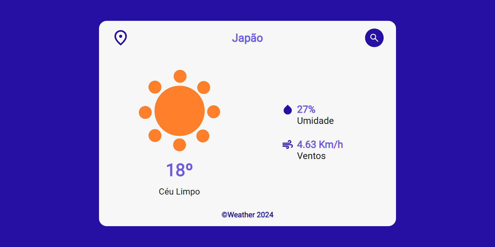
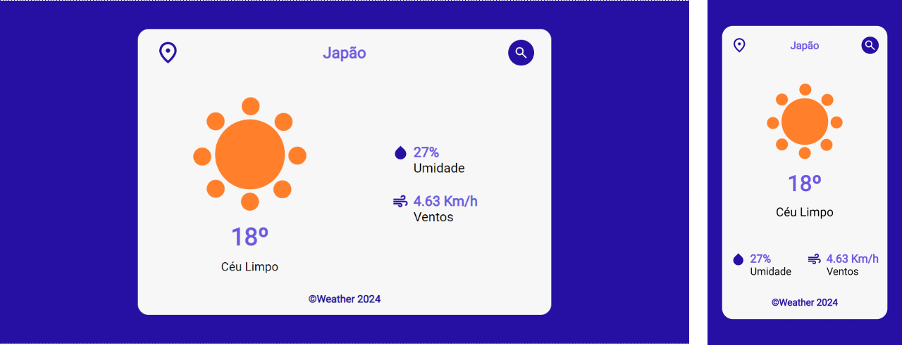

# **Weather**

<!--  -->

## Sobre o projeto

A aplicação Weather utiliza React.js com TypeScript para criar uma experiência rápida e tipada. Integra a API Open Weather Map para fornecer dados meteorológicos atualizados. O layout responsivo é garantido com CSS modules, oferecendo uma interface adaptável e estilizada.

#### About the project

The Weather app uses React.js with TypeScript to create a fast, typed experience. Integrates the Open Weather Map API to provide up-to-date weather data. Responsive layout is guaranteed with CSS modules, offering an adaptable and stylized interface.

## Layout Desktop e Mobile (Desktop and Mobile Layout)

## Tecnologias Utilizadas (Technologies Used)
* HTML5
* CSS3
* Flexbox
* JavaScript
* API [Open Weather Map](http://openweathermap.org/api)
* Typescript
* React Js Vite

## Instalação (Installation)

##### Instalar Dependências (Install Dependencies)
<pre><code>npm install</code></pre>

##### Executar Aplicação (Run Application)
<pre><code>npm run dev</code></pre>

## Autor (Author)

#### **Katarine Albuquerque**

 &nbsp; 
